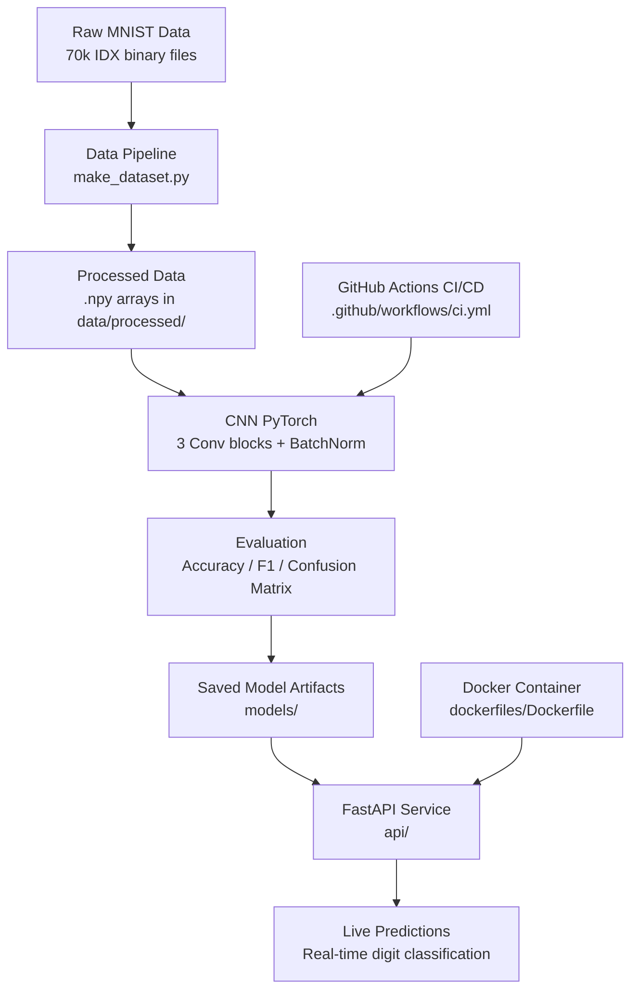

# PROJECT - S4P MNIST

**Live Demonstration:** [Link](https://www.youtube.com/watch?v=lf3HbEi7m9Y)

## 👥 Team Information

- **Team Name:** S4P
- **Team Members:** *Cai Cindy (ccai5@depaul.edu)*,
                    *Riffa Hammed (rriffaha@depaul.edu)*,
                    *Sai Subodh Gundam Raju (sgundamr@dgepaul.edu)*,
                    *Saumyaa Kannan (skannan3@depaul.edu)*
- **Course & Section:** SE489 ML ENGINEERING FOR PRODUCTION
                        Section:(930 Online: Sync - 910 Online: Async)
---
## 🧠 Project Overview

🚀 S4P MNIST is an end-to-end machine learning engineering project that designs,
trains, evaluates, and deploys a handwritten digit classifier on the MNIST dataset - 70,000 grayscale images of handwritten digits around 10 classes (0-9) across 60,000 training
and 10,000 test samples. The project goes beyond model accuracy, emphasizing
production-grade MLOps practices: reproducible data pipelines, experiment
tracking, containerization, continuous integration, and a live deployed
interface for real-time predictions. Built across three phases, S4P MNIST
demonstrates a complete ML project lifecycle from raw data ingestion through
to a scalable, monitored, and user-accessible deployment.

🎯 **Key Objectives:**
- [x] 🔬 Design and train a high-accuracy digit classification model with fully
      reproducible data processing and experiment tracking
- [x] 🐳 Containerize and automate the ML pipeline using Docker and CI/CD tools
      to ensure consistent, scalable execution
- [x] 🌐 Deploy the trained model as a live, user-accessible application capable
      of making real-time predictions on new handwritten digit inputs
---
## Architecture Diagram


---
## Phase Deliverables

### Phase 1: Project Design & Model Development
- See [docs/PHASE1.md](docs/PHASE1.md) for phase documentation.

### Phase 2: Containerization & Monitoring
- See [docs/PHASE2.md](docs/PHASE2.md) for phase documentation.

### Phase 3: CI/CD & Deployment
- See [docs/PHASE3.md](docs/PHASE3.md) for phase documentation.
---
## Setup Instructions

### Prerequisites
- Python 3.11+ installed
- Git installed
- Docker Desktop (for containerized execution)

### Installation

**Option 1: Using uv (recommended - faster)**
```bash
pip install uv
uv pip install -r requirements.txt
```

**Option 2: Using pip**
```bash
pip install -U pip
pip install -r requirements.txt
```

### Development Setup

```bash
# Install development dependencies
pip install -r requirements_dev.txt

# Set up pre-commit hooks
pre-commit install

# Run tests to verify setup
pytest tests/
```

### Running the Pipeline

```bash
# Prepare data
make data

# Train the model
make train

# Generate predictions
make predict

# See all available commands
make help
```

### Local Gradio Demo

The repository includes `app.py`, a Gradio demo that forwards handwritten digit images to the deployed FastAPI endpoint.

- Set `MODEL_API_URL` to your Cloud Run service URL.
- Run locally with:

```bash
python app.py
```

### Hugging Face Space Deployment

A GitHub Actions workflow (`.github/workflows/hf_spaces.yml`) deploys this repo to a Hugging Face Space when `main` is pushed.

The workflow requires two GitHub secrets:
- `HF_API_TOKEN` — Hugging Face API token with Space write permissions
- `HF_SPACE_ID` — the Space repository identifier, e.g. `username/space-name`

The deployed Space also uses the `MODEL_API_URL` environment variable to point to the Cloud Run backend endpoint.

### Configuration (Hydra — Phase 2)

The professor wanted Hydra for Part F, so train and predict both read `configs/config.yaml` (the file that was already in the template). Same file holds CNN training settings and the `predict:` paths, which keeps the repo simple.

```bash
make train
python -m s4p_mnist.train_model training.epochs=3 training.batch_size=256
python -m s4p_mnist.predict_model predict.output_file=out/preds.csv
```

If you typo something like `training.epochs=0`, it errors out immediately instead of halfway through an epoch loop.

More detail is in `configs/README.md` and `docs/PHASE2.md` section 6.

### Logging (Phase 2)

Logs are written to both the terminal (colored via `rich`) and `logs/s4p_mnist.log` (rotating file).

```bash
# View live logs during training
tail -f logs/s4p_mnist.log
```

### WandB Experiment Tracking (Phase 2)

```bash
# Login once
wandb login

# Training auto-logs to W&B (enabled by default)
make train

# Disable W&B if needed
python -m s4p_mnist.train_model training.wandb=false
```

---
## Technology Stack

### Core Dependencies
- **numpy** >= 1.26.0 - Numerical computing
- **pandas** >= 2.2.0 - Data manipulation
- **scikit-learn** >= 1.5.0 - Machine learning algorithms
- **matplotlib** >= 3.9.0 - Visualization
- **tqdm** >= 4.66.0 - Progress bars
- **pyyaml** >= 6.0 - Configuration files
### Deep Learning (PyTorch)
- **torch** >= 2.3.0 - PyTorch framework
### Experiment Tracking
- **wandb** >= 0.18.0 - Weights & Biases
### Configuration Management
- **hydra-core** >= 1.3.0 - Hydra configuration framework
- **omegaconf** >= 2.3.0 - Hierarchical configuration
### Logging & Monitoring
- **rich** >= 13.0.0 - Colored terminal output, progress bars, pretty tracebacks
- **wandb** >= 0.18.0 - Weights & Biases experiment tracking and system monitoring
### Data Version Control
- **dvc** >= 3.55.0 - Data Version Control
### API & Serving (Phase 3)
- **fastapi** >= 0.115.0 - REST API framework for the inference service
- **uvicorn[standard]** >= 0.30.0 - ASGI server for FastAPI
- **python-multipart** >= 0.0.9 - File upload handling for the image endpoint
- **pillow** >= 10.0.0 - Image decoding for uploaded digits
### Deployment & Cloud (Phase 3)
- **google-cloud-storage** >= 2.18.0 - GCS access for dataset and model artifacts
- **functions-framework** >= 3.8.0 - GCP Cloud Functions Gen 2 runtime
- **mangum** >= 0.19.0 - ASGI adapter so FastAPI runs on Cloud Functions
### Interactive UI (Phase 3)
- **gradio** >= 3.0 - Hugging Face Spaces demo interface
- **requests** >= 2.31.0 - Calls the deployed inference endpoint from the Gradio app
---
## Project Structure

This template uses the modern **`src/` layout** — the importable package lives in `src/s4p_mnist/`, decoupled from the repository root. That forces `pip install -e .` before imports work, which catches packaging bugs early.

```
s4p_mnist/                  # Repository root
├── src/
│   └── s4p_mnist/          # Importable Python package
│       ├── __init__.py                # Version + package metadata
│       ├── config.py                  # Paths & typed config (PROJECT_ROOT, TrainingConfig, ...)
│       ├── logging_config.py          # setup_logging() + get_logger()
│       ├── data/
│       │   ├── __init__.py
│       │   ├── loaders.py             # load_raw / load_processed / save_processed
│       │   └── make_dataset.py        # Raw → processed pipeline CLI
│       ├── features/
│       │   ├── __init__.py
│       │   └── build_features.py      # Feature engineering
│       ├── models/
│       │   ├── __init__.py
│       │   ├── base.py                # BaseModel ABC (fit/predict/save/load)
│       │   └── model.py               # Concrete Model scaffold
│       ├── evaluation/
│       │   ├── __init__.py
│       │   └── metrics.py             # classification_report, regression_report
│       ├── visualization/
│       │   ├── __init__.py
│       │   └── visualize.py           # Plot helpers
│       ├── utils/
│       │   ├── __init__.py
│       │   ├── io.py                  # JSON helpers
│       │   └── seed.py                # set_seed for reproducibility
│       ├── train_model.py             # Training CLI
│       └── predict_model.py           # Inference CLI
├── tests/                             # Unit and integration tests
│   ├── __init__.py
│   ├── conftest.py
│   ├── test_data.py
│   └── test_model.py
├── data/
│   ├── raw/                           # Immutable raw data
│   └── processed/                     # Cleaned, transformed data
├── models/                            # Trained model artifacts (.joblib)
├── notebooks/                         # Jupyter notebooks for exploration
├── reports/
│   └── figures/                       # Generated analysis and figures
├── docs/                              # MkDocs documentation
│   ├── mkdocs.yml
│   ├── index.md
│   ├── getting_started.md
│   └── api.md
├── dockerfiles/                       # Docker configuration
│   └── Dockerfile
├── configs/                           # Hydra configuration (if selected)
│   └── config.yaml
├── api/                               # FastAPI service (if selected)
├── .github/workflows/                 # GitHub Actions CI/CD
│   ├── ci.yml
│   ├── cml.yml
│   ├── docker.yml
│   └── hf_spaces.yml
├── PHASE1.md                          # Phase 1 deliverables checklist
├── PHASE2.md                          # Phase 2 deliverables checklist
├── PHASE3.md                          # Phase 3 deliverables checklist
├── .pre-commit-config.yaml            # Pre-commit hooks (Ruff, mypy)
├── Makefile                           # Common commands
├── docker-compose.yaml                # Docker Compose setup
├── pyproject.toml                     # Project config & dependencies
├── requirements.txt                   # Runtime dependencies
├── requirements_dev.txt               # Development dependencies
├── LICENSE
└── README.md
```

### Why `src/` layout?

| | `src/` layout (this template) | Flat layout |
|---|---|---|
| Forces `pip install -e .` before import | ✅ | ❌ |
| Catches packaging bugs early | ✅ | ❌ |
| Adopted by | attrs, httpx, pydantic, flask, sqlalchemy | Older data-science templates |

Data and model artifacts are accessed via the constants in `s4p_mnist.config` (`PROJECT_ROOT`, `DATA_DIR`, `MODELS_DIR`, …) rather than relative paths — code is independent of where you invoke it from.

## Common Commands

```bash
# Install package + runtime dependencies (editable install)
make install
```

```bash
# Install dev tools + pre-commit hooks
make dev
```

```bash
# Run linting and formatting checks
make lint
```

```bash
# Auto-format code
make format
```

```bash
# Run tests
make test
```

```bash
# Clean up build artifacts
make clean
```

```bash
# Docker operations
make docker_build
make docker_run
```

```bash
# Serve documentation locally
make docs
```
---
## Troubleshooting

- Ensure Docker Desktop is running before `make docker_run`
- Set `WANDB_API_KEY` before enabling WandB logging
- Run `make data` if processed arrays are missing
- Apple Silicon users should verify PyTorch MPS support

---
## Contribution Summary

- **Cindy Cai** - Data exploration, EDA notebook, code review;
  Docker containerization (Dockerfile, build/run instructions, environment consistency) (Phase 2);
  Profiling & optimization (cProfile, PyTorch Profiler, MPS device support) (Phase 2);
  Automated Docker builds and CML, Hugging Face Spaces UI, end-to-end demo recording (Phase 3)

- **Riffa Hammed** - Data pipeline (raw MNIST IDX files → processed .npy arrays);
  WandB experiment tracking and system monitoring (Phase 2);
  Monitoring & debugging (pdb/ipdb, debug scenarios, model assertion checks) (Phase 2);
  Continuous integration and unit testing (pytest, GitHub Actions CI, pre-commit hooks) (Phase 3)

- **Sai Subodh Gundam Raju** - Model development and training (six algorithms including CNN, ~99.5% accuracy);
  Hydra configuration management (train and predict CLIs, config validation) (Phase 2);
  GCP deployment (Artifact Registry, Cloud Run, FastAPI inference service) (Phase 3)

- **Saumyaa Kannan** - Project documentation (README, PHASE1.md, project description);
  Application logging setup with rich+logging (Phase 2);
  PHASE2.md documentation, and README updates (Phase 2);
  PHASE3.md documentation, and README updates (Phase 3)

---
## References

- [Project Documentation](docs/index.md)
- [Phase 1 — Project Design & Model Development](docs/PHASE1.md)
- [Phase 2 — Containerization & Monitoring](docs/PHASE2.md)
- [Phase 3 — CI/CD & Deployment](docs/PHASE3.md)
---
## License

This project is licensed under the MIT License. See [LICENSE](LICENSE) for details.
