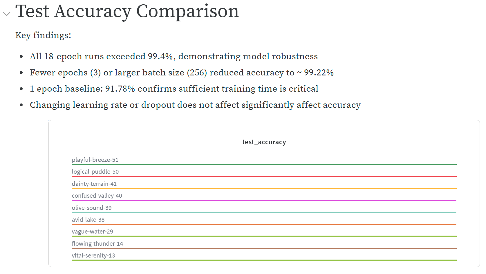
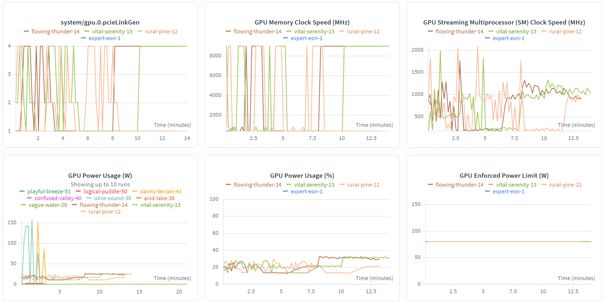
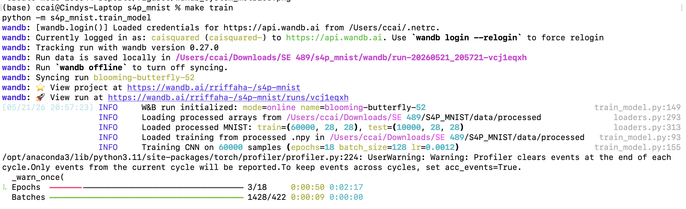

# PHASE 2: Enhancing ML Operations with Containerization & Monitoring

## Overview
Phase 2 builds on the S4P MNIST foundation from Phase 1 by operationalizing the machine learning pipeline. This phase introduces Docker containerization for reproducible cross-environment execution, WandB-based monitoring and experiment tracking, cProfile and PyTorch Profiler for performance analysis, structured logging with Python's `logging` library and `rich` for readable terminal output, and Hydra for configuration management. By the end of this phase, the pipeline can be built into a container, tracked across experiments, debugged interactively, and configured without touching code.

## 1. Containerization

### 1.1 Dockerfile

The Dockerfile is located in `/dockerfiles`. It is a multi-staged build that uses `python:3.11-slim-bookworm` as its base image and defines the data -> train -> predict pipeline as its entrypoint.

To build the docker image, use the `make docker_build` command. **Note: ensure that the `/data` folder is empty (does not contain any actual data) before you run the command.**

To run the docker image, ensure that are running from a directory that contains the required volumes. It should have this kind of structure:

```
(wd)
`-- data
    `-- raw
        |-- t10k-images.idx3-ubyte
        |-- t10k-labels.idx1-ubyte
        |-- train-images.idx3-ubyte
        |-- train_labels.idx3-ubyte
    `-- processed
`-- models
```

This allows the Docker container to read the data in from `\data` on your computer and write the model as an artifact to `\models`.

If you are just running from the s4p_mnist directory, you can directly use the command `make docker_run`. However, if you are running from your own local directory, then you should use the full command inside the terminal:

```
docker run -it --rm \
    --env-file .env WANDB_API_KEY=${WANDB_API_KEY} \
    -v "$(PWD)/data:/app/data" \
    -v "$(PWD)/models:/app/models" \
    s4p_mnist:latest
```

### 1.2 Environment Consistency

The container was tested locally by running `make docker_build` followed by `make docker_run`, confirming that training and inference behave consistently with the host environment.

All dependency versions are pinned in `requirements.txt` to ensure reproducible builds and consistent behavior across local and containerized environments.

## 2. Monitoring & Debugging

### 2.1 Monitoring

Monitoring is done with WandB. System metrics are automatically generated.

Weights & Biases (WandB) was chosen because it provides lightweight experiment monitoring, automatic system metrics tracking, GPU utilization dashboards, and collaborative experiment comparison tools with minimal setup overhead.

The monitored metrics include:
- test accuracy
- validation accuracy
- GPU utilization
- GPU memory usage
- GPU power consumption
- runtime duration

### 2.2 Debugging Practices

Interactive debugging is done with `pdb` (built-in) and `ipdb` (enhanced, with tab completion and syntax highlighting). Install `ipdb` with:

    pip install ipdb

To drop into an interactive debugger at any point in the code, insert:

    import ipdb; ipdb.set_trace()

This pauses execution and opens an interactive shell. Useful commands:

| Command | Action |
|---------|--------|
| `n` | Next line |
| `s` | Step into function |
| `c` | Continue to next breakpoint |
| `p <var>` | Print variable |
| `q` | Quit debugger |

---

#### Debug Scenario 1: NaN Values in Training Data

**Problem:** Training loss is `nan` from the first epoch. The model never learns.

**Cause:** `X_train` contains NaN or Inf values — e.g. a corrupted `.npy` file or a bad normalization step.

**Detection:** `_assert_no_nan()` in `train_model.py` raises immediately:

    AssertionError: X_train contains NaN values — check your data pipeline.

**How to investigate with ipdb:** Add a breakpoint in `load_training_xy` before the assertion:

    import ipdb; ipdb.set_trace()
    _assert_no_nan(x_arr, "X_train")

Then inspect:

    pp np.isnan(x_arr).sum()       # how many NaN values
    pp np.where(np.isnan(x_arr))   # which samples are affected
    pp x_arr.min(), x_arr.max()    # check value range

**Fix:** Re-run `make data` to regenerate clean processed files.

---

#### Debug Scenario 2: Shape Mismatch

**Problem:** Training crashes immediately with a dimension error inside the model.

**Cause:** `X_train` has shape `(N, 28, 28)` — images were not flattened before being passed to the model.

**Detection:** `_assert_shape()` in `train_model.py` raises immediately:

    AssertionError: Expected x shape (N, 784), got (60000, 28, 28). Images must be flattened 28x28 pixels.

**How to investigate with ipdb:** Add a breakpoint before the assertion:

    import ipdb; ipdb.set_trace()
    _assert_shape(x_arr, y_arr)

Then inspect:

    pp x_arr.shape    # should be (60000, 784)
    pp y_arr.shape    # should be (60000,)
    pp x_arr.dtype    # should be float32

**Fix:** Ensure `.reshape(X_train_img.shape[0], -1)` is called in `load_training_xy` before the assertions.

Structured logging was also used during debugging to trace dataset loading, model training, evaluation, and inference workflows.

## 3. Profiling & Optimization

### 3.1 Python-level Profiling

cProfile is used to profile the training script. To profile, run `make profile`. This profiles with cProfile and then visualizes the output (checked in as `stats.prof`) with snakeviz.

### 3.2 Framework Profiling

PyTorch profiling is integrated into the training script. The first epoch is analyzed, and profiling metrics are written to the Hydra output folder. Both cProfile and PyTorch profiling found that the bottleneck was in the backward pass with the model. To optimize this, the option "MPS" was given to the PyTorch device selector. Before, the device selector block looked like this:

```
class Model(BaseModel):
    def _device(self) -> torch.device:
        return torch.device("cuda" if torch.cuda.is_available() else "cpu")
```

After, it looks like this:

```
class Model(BaseModel):
    def _device(self) -> torch.device:
        if torch.backends.mps.is_available() and torch.backends.mps.is_built():
            return torch.device("mps")
        if torch.cuda.is_available():
            return torch.device("cuda")
        return torch.device("cpu")
```

This allows users on Mac computers to take advantage of GPU. On Cindy's computer, training time went from 20 minutes to 3 minutes.

### 3.3 Memory Profiling

Memory usage was monitored during training using PyTorch Profiler. Peak memory consumption during a training run was approximately 1.2 GB, which was within acceptable limits for the hardware used. No memory-specific optimizations were needed beyond what was already achieved by moving computation to MPS/GPU.

## 4. Experiment Management & Tracking

### 4.1 Experiment Tracking Tool

Weights & Biases is integrated into the model training. It is initialized with `wandb.init()` setting `entity="rriffaha-"` and `project="s4p-mnist"`. It logs all hyperparameters (epochs, batch_size, lr, dropout, weight_decay, val_fraction, seed) automatically via the configuration dictionary.

Each member of the team can run experiments on their own computers by running `wandb login` on their command line. Users running through Docker can provide their own WandB API key through the `WANDB_API_KEY` environment variable.

For each experiment, WandB saves the configuration, the accuracy of the model, and the model as an artifact. Comparing runs is easy with the WandB dashboard. The final test accuracy is logged as both a metric and pinned to the run summary. The trained model is saved as a versioned W&B Artifact with hyperparameters in the metadata.

WandB is automatically enabled (in the Hydra configuration file, `training.wandb=true`). To disable WandB, one can run:

```
python -m s4p_mnist.train_model training.wandb=false
```

W&B Report: [Report](https://api.wandb.ai/links/rriffaha-/epd7z4xp)

### 4.2 Experiment Results

Three experiments were run to evaluate the effect of learning rate and dropout:

| Run | Learning Rate | Dropout | Test Accuracy |
|-----|--------------|---------|---------------|
| rural-pine-12 | 0.0012 | 0.3 | 99.45% |
| vital-serenity-13 | 0.005 | 0.3 | 99.50% |
| flowing-thunder-14 | 0.0012 | 0.5 | 99.53% |

Best model: `flowing-thunder-14`. The best model is saved as W&B Artifact `s4p-mnist-model:v0`. However, the improvement is negligible and may be due to random chance.

### 4.3 Visualization & Sharing

Teammates compared runs using the WandB dashboard and shared reports. Metrics such as accuracy, GPU utilization, runtime, and hyperparameters can be visualized side-by-side to identify the best performing experiment configurations.


*Figure 1: WandB experiment comparison dashboard showing accuracy across runs.*



*Figure 2: WandB system metrics dashboard showing GPU utilization and memory usage.*

## 5. Application & Experiment Logging

### 5.1 Logging Setup

Logs are done by a combination of Python's stdlib `logging` and `rich`. Logging is configured in `logging_config.py`. The logging level is set to INFO and there are two handlers set up: (1) a `RichHandler` for the rich-colored console output, and (2) a `RotatingFileHandler` that writes to `logs/s4p_mnist.log`.

**Log format:**
timestamp | level | module | message

Example training output:

```
2026-05-21 13:40:29 | INFO     | s4p_mnist.train_model | W&B run initialized:
mode=online name=logical-blaze-49
2026-05-21 13:40:29 | INFO     | s4p_mnist.data.loaders | Loading processed arrays
from /Users/ccai/Downloads/SE 489/S4P_MNIST/data/processed
2026-05-21 13:40:29 | INFO     | s4p_mnist.data.loaders | Loaded processed MNIST:
train=(60000, 28, 28), test=(10000, 28, 28)
2026-05-21 13:40:30 | INFO     | s4p_mnist.train_model | Loaded training from
processed .npy in /Users/ccai/Downloads/SE 489/S4P_MNIST/data/processed
2026-05-21 13:40:30 | INFO     | s4p_mnist.train_model | Training CNN on 60000
samples (epochs=18 batch_size=128 lr=0.0012)
2026-05-21 13:43:34 | INFO     | s4p_mnist.train_model | Finished training model
for 18 epochs
2026-05-21 13:43:34 | INFO     | s4p_mnist.train_model | Saved trained model to
/Users/ccai/Downloads/SE 489/S4P_MNIST/models/model.joblib
2026-05-21 13:43:34 | INFO     | s4p_mnist.data.loaders | Loading processed arrays
from /Users/ccai/Downloads/SE 489/S4P_MNIST/data/processed
2026-05-21 13:43:34 | INFO     | s4p_mnist.data.loaders | Loaded processed MNIST:
train=(60000, 28, 28), test=(10000, 28, 28)
2026-05-21 13:43:34 | INFO     | s4p_mnist.train_model | Evaluating on processed
test arrays from /Users/ccai/Downloads/SE 489/S4P_MNIST/data/processed
2026-05-21 13:43:34 | INFO     | s4p_mnist.train_model | Held-out MNIST test accuracy:
0.994900
2026-05-21 13:43:39 | INFO     | s4p_mnist.train_model | W&B run finished
2026-05-21 13:43:39 | INFO     | s4p_mnist.train_model | Training complete
```

Example prediction output:

```
2026-05-21 14:17:28 | INFO     | s4p_mnist.predict_model | Loading model from
/Users/ccai/Downloads/SE 489/S4P_MNIST/models/model.joblib
2026-05-21 14:17:28 | INFO     | s4p_mnist.predict_model | Scoring
/Users/ccai/Downloads/SE 489/S4P_MNIST/data/processed
2026-05-21 14:17:28 | INFO     | s4p_mnist.data.loaders | Loading processed arrays
from /Users/ccai/Downloads/SE 489/S4P_MNIST/data/processed
2026-05-21 14:17:28 | INFO     | s4p_mnist.data.loaders | Loaded processed MNIST:
train=(60000, 28, 28), test=(10000, 28, 28)
2026-05-21 14:17:28 | INFO     | s4p_mnist.predict_model | Wrote 10000 rows to
/Users/ccai/Downloads/SE 489/S4P_MNIST/predictions.csv
2026-05-21 14:17:28 | INFO     | s4p_mnist.predict_model | Prediction complete
```

**The log entries indicate:**
- dataset loading
- training initialization
- model saving
- evaluation progress
- experiment tracking lifecycle events

**Log levels used:**
- `DEBUG` — internal state, array shapes (not shown in default output)
- `INFO` — pipeline milestones: data loading, training start/end, accuracy, model save
- `WARNING` — fallbacks, e.g. processed `.npy` not found, falling back to torchvision
- `ERROR` — caught via `rich.traceback.install()` with full traceback and local variables

Exceptions and runtime failures are logged with contextual information to simplify debugging and failure analysis.

### 5.2 Rich Output

Rich has been integrated so that there are colored levels and also a progress bar during training to show completed batches and epochs.

Pretty tracebacks are enabled using:

```python
from rich.traceback import install
install(show_locals=True)
```


*Figure 3: Rich-enhanced terminal logging during model training, showing colored log levels, epoch/batch progress bars, training status updates, and experiment lifecycle events.*

## 6. Configuration Management

Hydra's configuration hierarchy is organized into sections on both entry points, `train_model.py` and `predict_model.py`, with `@hydra.main` pointing at the same `configs/config.yaml` file the starter repo came with. Training parameters (epochs, batch size, lr, weight decay, dropout, seed, val split) plus the `paths` entries for processed MNIST and the `models/` folder all sit in the yaml. Prediction is configured under a `predict:` block in that same file so `predict_model` does not need its own configuration file.

Before either script does real work it sanity-checks the configuration (epochs at least 1, dropout between 0 and 1, val split between 0 and 1, paths not blank). `hydra.job.chdir` is false and paths still get resolved from `PROJECT_ROOT`, so Hydra's output folders get created in the project directory.

The default configuration is in `configs/config.yaml` and the default hyperparameters are the same as from part 1, just wired with Hydra. To experiment, one can override the hyperparameters from the command line. For example:

```
python -m s4p_mnist.train_model training.epochs=3 training.batch_size=256
```

trains the model with the number of epochs changed to 3 and the batch size changed to 256. One can track the results of the different experiments with WandB. The default configuration gives us an accuracy of 99.5% while the customized configuration gives us an accuracy of 99.2%.

## 7. Documentation & Repository Updates

### 7.1 Updated README

The base README has been updated with a Phase 2 section that links to this document and summarizes all new tools (Docker WandB, PyTorch Profiler, rich+logging, Hydra).

### 7.2 Tool Integration Summary

| Tool | Where used | How to use |
|------|-----------|-----------|
| Docker | `dockerfiles/Dockerfile` | `make docker_build && make docker_run` |
| WandB | `train_model.py` | `make train` (auto-enabled) or `training.wandb=false` to disable |
| PyTorch Profiler | `model.py` | Runs automatically on epoch 0, writes to Hydra output dir |
| rich + logging | `logging_config.py` | Called via `setup_logging()` in train/predict scripts |
| Hydra | `configs/config.yaml` | Override any param: `python -m s4p_mnist.train_model training.epochs=5` |

### 7.3 Troubleshooting

- Ensure Docker Desktop is running before executing `make docker_run`
- Ensure `WANDB_API_KEY` is set before enabling WandB logging
- If training fails with NaN values, regenerate processed data using `make data`
- If running on Apple Silicon, ensure PyTorch MPS support is available

### 7.4 PHASE2.md

For phase 2, the contributions are as follows:

- Cindy: Section 1 (Containerization) / Section 3 (Profiling & Optimization)
- Subodh: Section 6 (Configuration Management)
- Riffa: Section 2 (Monitoring & Debugging) / Section 4 (Experiment Management & Tracking)
- Saumyaa: Section 5 (Application & Experiment Logging) / Section 7 (Documentation & Repository Updates)
