# Phase 3: Continuous Machine Learning (CML) and Deployment

## Overview

## 1. Continuous Integration & Testing


### 1.1 Unit Testing with pytest

**File:** `tests/test_data.py`

Tests cover the entire data layer: the IDX binary parser (`src/s4p_mnist/data/loaders.py`) and the pipeline CLI (`src/s4p_mnist/data/make_dataset.py`). The 34 tests are organized into 8 classes:

| Class | What it tests |
|-------|--------------|
| `TestReadIdxImages` | IDX3 parser: shape, dtype, value roundtrip, missing file, bad magic, truncated header, body mismatch |
| `TestReadIdxLabels` | IDX1 parser: same coverage as images |
| `TestLoadRaw` | All four array shapes/dtypes, train/test size mismatch, label out of range, missing file |
| `TestSaveAndLoadProcessed` | File creation, value/dtype roundtrip, missing files error with `make data` hint, auto-creates directory |
| `TestProcessedFilesExist` | All present, empty dir, partial presence |
| `TestMakeDataset` | Creates files, idempotent (no-force skips), force triggers reprocessing, missing raw raises |
| `TestMain` | CLI exit codes 0/1, `--force` flag accepted |

All tests are self-contained: synthetic IDX binary files are generated on the fly using pytest's `tmp_path` fixture so the real MNIST data files are never required in CI.

To run locally:

```
uv run pytest tests/test_data.py -v
```

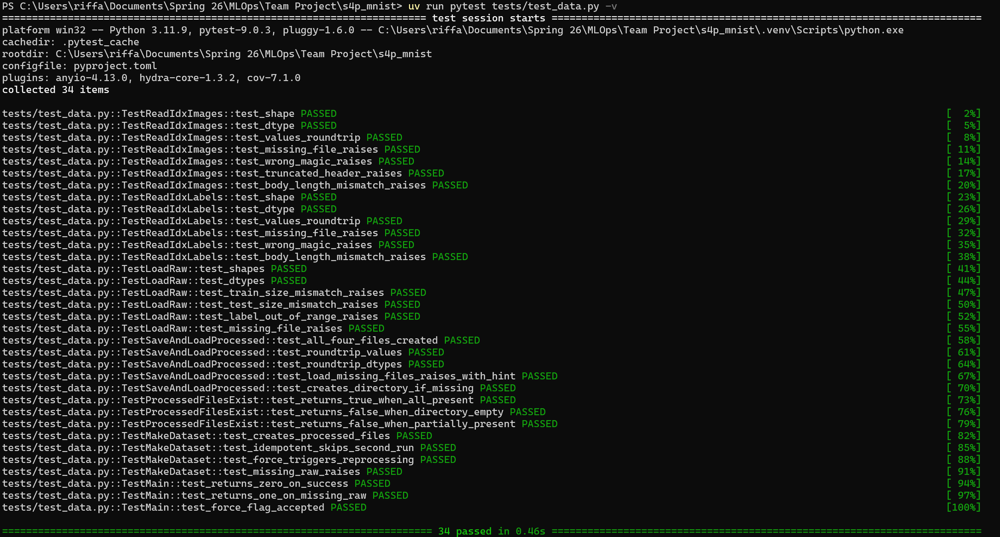
*Figure: All 34 data layer tests passing locally (Python 3.11.9, pytest 9.0.3).*

---

### 1.2 GitHub Actions CI Workflow

**File:** `.github/workflows/ci.yml`

The CI workflow triggers on every push and pull request to `main` and runs the following steps against Python 3.11:

1. Install dependencies from `requirements.txt` and `requirements_dev.txt`
2. `ruff check .` — lint
3. `ruff format --check .` — format check
4. `pip install -e .` — install the project package
5. `mypy src/s4p_mnist` — static type checking
6. `pytest tests/ --cov=s4p_mnist --cov-report=xml` — run all tests with coverage
7. Upload coverage report to Codecov

The workflow ensures that every PR to `main` is lint-clean, type-safe, and fully tested before merging.

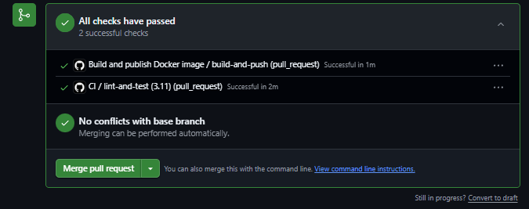

*Figure: Both CI checks green on PR #18 — lint-and-test (3.11) and build-and-push.*

---

### 1.3 Pre-commit Hooks

**File:** `.pre-commit-config.yaml`

Pre-commit hooks enforce code quality before any commit lands. Three hook sets are active:

| Hook | What it enforces |
|------|-----------------|
| `ruff` (with `--fix`) | Auto-fixes lint errors on commit |
| `ruff-format` | Consistent code formatting |
| `mypy` | Type checking with `--ignore-missing-imports` |
| `trailing-whitespace` | No trailing spaces |
| `end-of-file-fixer` | Files end with a newline |
| `check-yaml` | Valid YAML syntax |

To install the hooks in your local clone:

```
pip install pre-commit
pre-commit install
```

After installation, every `git commit` runs the checks automatically. To run manually against all files:

```
pre-commit run --all-files
```

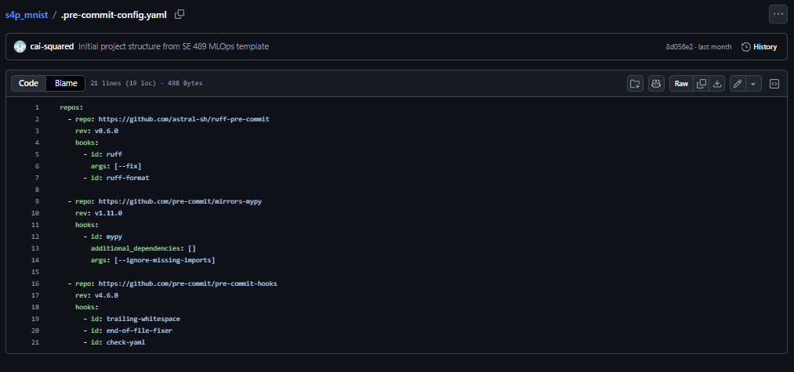
*Figure: `.pre-commit-config.yaml` at repo root with ruff, mypy, and standard hooks.*

---

## 2. Continuous Docker Building & CML

### 2.1 Automated Docker Builds

Docker builds are automated with this [GitHub Workflow](../.github/workflows/docker.yml). With every commit to main, the image will be built and pushed to the caisquared/s4p_mnist repository on Docker Hub.

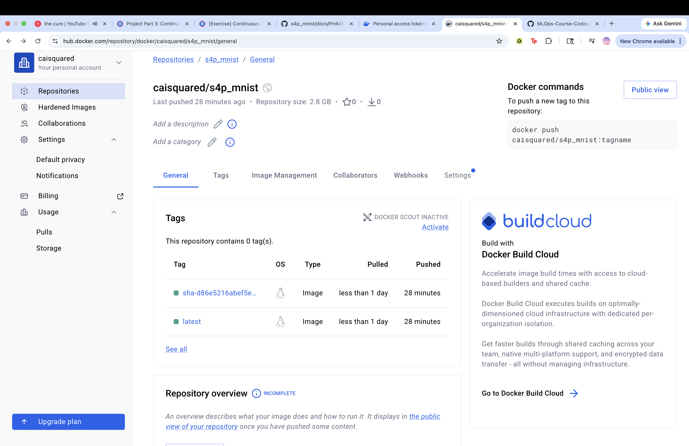
*Figure: Docker Hub repository caisquared/s4p_mnist with the latest image.*

To pull the docker image, run

```
docker pull caisquared/s4p_mnist:latest
 ```

if you're running on a mac you can use the `--platform linux/amd64` flag.

To run the docker image, run

```
docker run -it --rm \
    --env-file .env \
    -v "$(PWD)/data:/app/data" \
    -v "$(PWD)/models:/app/models" \
    caisquared/s4p_mnist:latest
```

### 2.2 Continuous Machine Learning (CML)

CML is integrated in this [GitHub Workflow](../.github/workflows/cml.yml) so that a PR triggers a model training and posts a comment back on the PR with a link to the W&B run, the classification report, and the confusion matrix.

An example PR is at this link: [PR 23](https://github.com/cai-squared/s4p_mnist/pull/23)

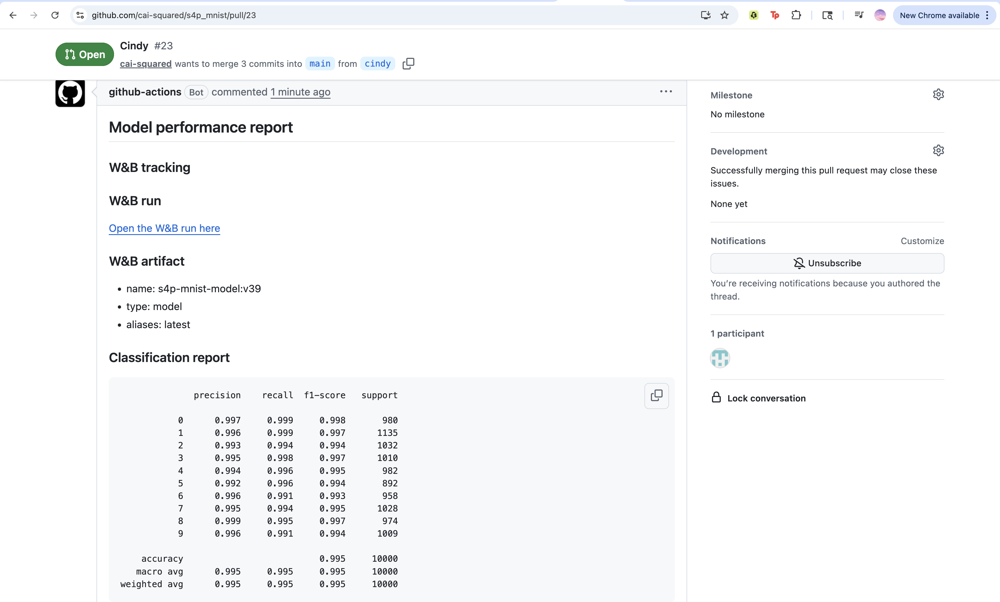
*Figure: PR comment with W&B link and classification report visible.*

## 3. Deployment on Google Cloud Platform (GCP)

Section 3 owner: Sai Subodh Gundam Raju. We deployed the trained CNN with FastAPI on Google Cloud Run.

**Live service URL:** https://s4p-mnist-api-912752055925.us-central1.run.app

### 3.1 GCP Artifact Registry

I created GCP project **s4p-mnist** and enabled Artifact Registry and Cloud Run. The inference image is stored in `us-central1` under repository **s4p-mnist**. From Google Cloud Shell I built the container and pushed it to:

`us-central1-docker.pkg.dev/s4p-mnist/s4p-mnist/api:latest`

Cloud Run pulls this image when the service starts.

### 3.2 Model file for serving

Training uses `make train` on a team machine and writes `models/model.joblib`. That file is not in Git because it is large. For cloud deploy I uploaded `model.joblib` in Cloud Shell and included it in the Docker build context before `docker build`. The API reads `S4P_MODEL_PATH` (default `/app/models/model.joblib` in the container).

### 3.3 FastAPI service

Code is in `api/main.py` and `api/schemas.py`.

| Route | What it does |
|-------|----------------|
| GET `/health` | Service status and model loaded flag |
| POST `/predict` | 784 pixel values → digit 0-9 |
| POST `/predict/grid` | 28×28 grid → digit |
| POST `/predict/image` | Image upload → digit |

Local test on Windows:

```
py -3.11 -m uvicorn api.main:app --reload --host 127.0.0.1 --port 8000
```

Then open `http://127.0.0.1:8000/docs`.

**Health check (live deploy):**

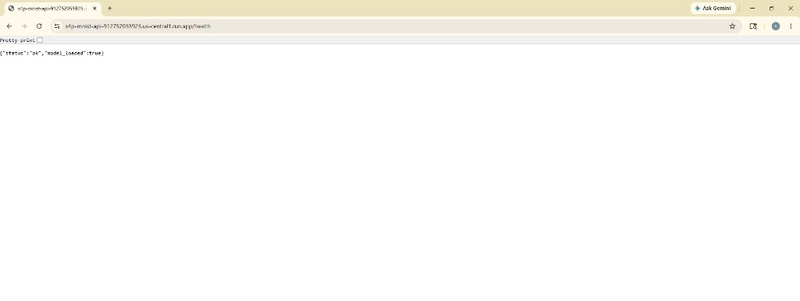
*Figure: Live `/health` response — status ok, model loaded.*

**Predict test (live deploy):**

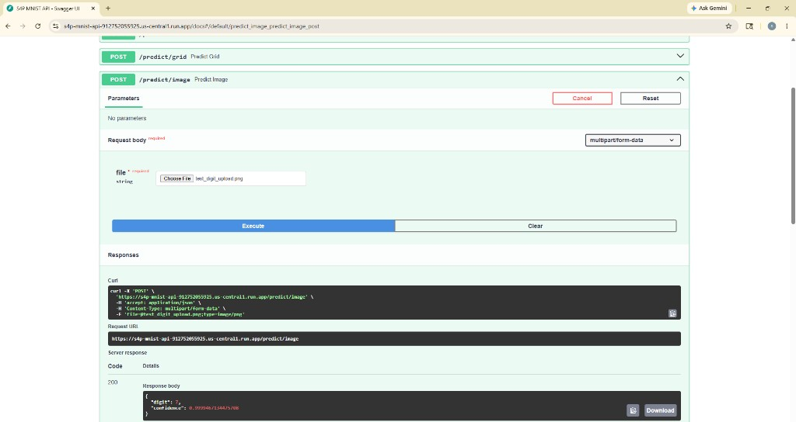
*Figure: POST `/predict/image` with test_digit_upload.png.*

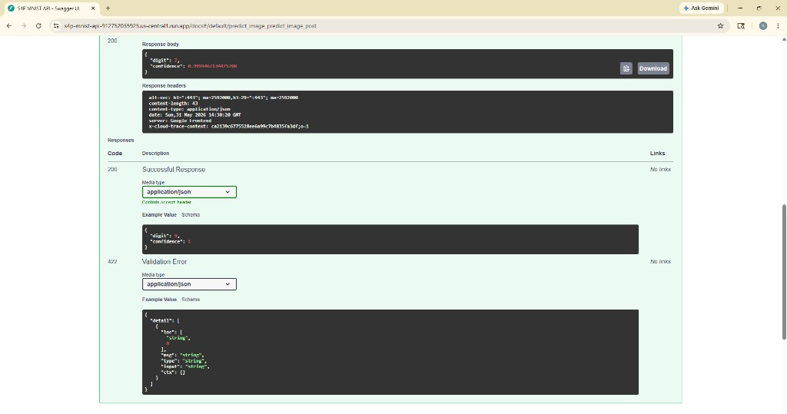
*Figure: Response digit 7 with 99.99% confidence.*

### 3.4 Cloud Run

Deploy command (run in Cloud Shell):

```
gcloud run deploy s4p-mnist-api \
  --image us-central1-docker.pkg.dev/s4p-mnist/s4p-mnist/api:latest \
  --region us-central1 \
  --allow-unauthenticated \
  --memory 2Gi \
  --port 8080 \
  --set-env-vars S4P_SERVE=1
```

The Dockerfile uses `S4P_SERVE=1` so the container runs uvicorn instead of the training entrypoint `flow.sh`.

**Monitoring (Cloud Run metrics):**

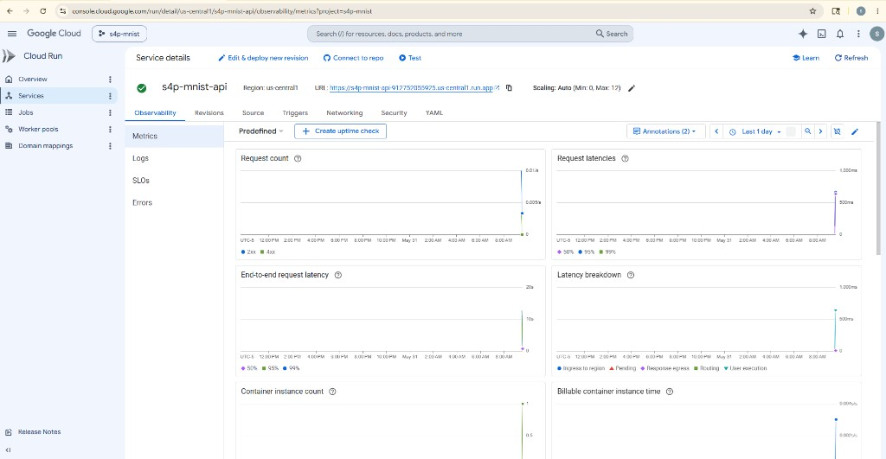
*Figure: Request count and latency metrics after live testing.*

When the class ends we delete the Cloud Run service to avoid charges:

```
gcloud run services delete s4p-mnist-api --region us-central1
```

## 4. Interactive UI

### 4.1 Gradio app on Hugging Face Spaces

The repository now includes a live demo app at `app.py` that calls the Cloud Run deployment endpoint for predictions.

- The app sends each drawn or uploaded image to the backend inference endpoint.
- The app displays the predicted digit and confidence score in a friendly interface.

This deployment is wired into GitHub Actions so pushing to `main` updates the Space automatically.

The redeploy workflow is at `.github/workflows/hf_spaces.yml`

Try the app out for yourself [here](https://huggingface.co/spaces/caisquared/s4p_mnist).

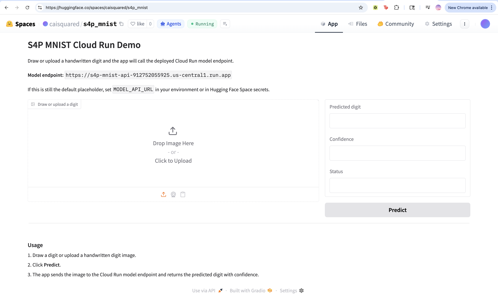
*Figure: Live Gradio app on Hugging Face Spaces.*

## 5. End-to-End Demo Recording

### 5.1 Recording in main README

A YouTube video demonstrating the project has been added at the top of the README (under the HuggingFace metadata).

## 6. Documentation, Repository Updates & Cleanup

### 6.1 Comprehensive README

The base README has been updated with a Phase 3 section that links to this document and summarizes the new tools and services added in this phase (GitHub Actions CI/CD, automated Docker builds, CML, GCP Artifact Registry and Cloud Run, FastAPI, and the Gradio app on Hugging Face Spaces). The end-to-end demo recording is embedded near the top of the README as a **Live Demonstration** link.

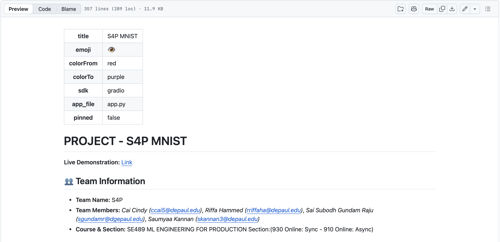
*Figure: Main README rendered on GitHub, showing the Live Demonstration link near the top.*

### 6.2 PHASE3.md

This document (`docs/PHASE3.md`) records each Phase 3 deliverable with its file/directory reference, a screenshot of the working result, and a short explanation. It is linked from
the main README.

### 6.3 GCP Resource Cleanup
